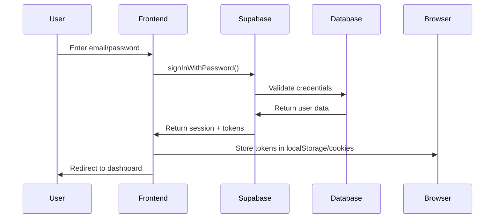
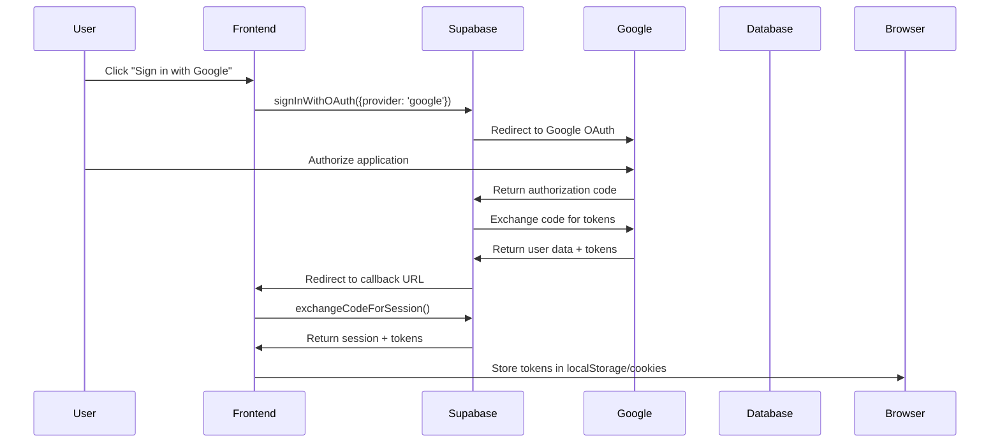

# Authentication Token Storage Troubleshooting Guide

## Overview

This guide addresses authentication token storage issues in web applications using Supabase, particularly focusing on discrepancies between email login and Google OAuth authentication flows.

## 1. Current Authentication Flow Analysis

### Email Login Flow


### Google OAuth Flow


## 2. Expected Cookie Storage Behavior

### Successful Token Storage Should Include:
- `sb-access-token`: JWT access token (expires in 1 hour)
- `sb-refresh-token`: Refresh token (expires in 30 days)
- Session persistence across browser restarts
- Automatic token refresh before expiration

### Cookie Attributes:
```javascript
{
  httpOnly: true,        // Server-side only access
  secure: true,          // HTTPS only in production
  sameSite: 'lax',      // CSRF protection
  maxAge: 2592000,      // 30 days for refresh token
  path: '/'             // Available site-wide
}
```

## 3. Common Implementation Issues

### Issue 1: Inconsistent Storage Configuration
**Problem**: Different storage mechanisms for email vs OAuth
**Symptoms**: Tokens stored for email login but not OAuth

```javascript
// ❌ INCORRECT - Using legacy @supabase/supabase-js
import { createClient } from '@supabase/supabase-js' // ❌ Legacy approach

const supabase = createClient(url, key, {
  auth: { persistSession: true }
})
```

**Solution**: Use @supabase/ssr for better session management
```javascript
// ✅ CORRECT - Using @supabase/ssr
import { createBrowserClient } from '@supabase/ssr'

// For client-side
const supabase = createBrowserClient(url, key)

// For server-side
import { createServerClient } from '@supabase/ssr'
const supabase = createServerClient(url, key, {
  cookies: {
    get(name: string) {
      return request.cookies.get(name)?.value
    },
    set(name: string, value: string, options: any) {
      // Handle cookie setting
    },
    remove(name: string, options: any) {
      // Handle cookie removal
    },
  },
})
```

### Issue 2: Missing Callback URL Configuration
**Problem**: OAuth redirect doesn't complete session exchange
**Symptoms**: User redirected but not authenticated

```javascript
// ❌ INCORRECT - Missing or wrong callback URL
const { error } = await supabase.auth.signInWithOAuth({
  provider: 'google'
  // Missing redirectTo option
})
```

**Solution**: Proper callback configuration
```javascript
// ✅ CORRECT - Proper callback URL
const { error } = await supabase.auth.signInWithOAuth({
  provider: 'google',
  options: {
    redirectTo: `${window.location.origin}/auth/callback`
  }
})
```

### Issue 3: Incomplete Session Exchange
**Problem**: OAuth callback doesn't exchange code for session
**Symptoms**: URL contains code but user not authenticated

```javascript
// ❌ INCORRECT - Missing code exchange in callback
export async function GET(request: Request) {
  const { searchParams } = new URL(request.url)
  const code = searchParams.get('code')
  
  if (code) {
    // Missing: exchangeCodeForSession
    return NextResponse.redirect('/')
  }
}
```

**Solution**: Complete session exchange
```javascript
// ✅ CORRECT - Proper code exchange
export async function GET(request: Request) {
  const { searchParams } = new URL(request.url)
  const code = searchParams.get('code')
  
  if (code) {
    const supabase = createServerClient(supabaseUrl, supabaseAnonKey, {
      cookies: {
        get(name: string) {
          return request.cookies.get(name)?.value
        },
        set(name: string, value: string, options: any) {
          // Handle cookie setting
        },
        remove(name: string, options: any) {
          // Handle cookie removal
        },
      },
    })
    const { error } = await supabase.auth.exchangeCodeForSession(code)
    
    if (error) {
      return NextResponse.redirect('/auth/login?error=oauth_error')
    }
  }
  
  return NextResponse.redirect('/')
}
```

### Issue 4: Cookie Domain/Path Mismatch
**Problem**: Cookies not accessible across routes
**Symptoms**: Authentication works on some pages but not others

```javascript
// ❌ INCORRECT - Restrictive cookie settings
document.cookie = `sb-access-token=${token}; path=/auth; domain=subdomain.example.com`
```

**Solution**: Proper cookie scope
```javascript
// ✅ CORRECT - Accessible site-wide
document.cookie = `sb-access-token=${token}; path=/; domain=.example.com; secure; samesite=lax`
```

## 4. Step-by-Step Debugging Process

### Step 1: Verify Supabase Configuration
```javascript
// Check environment variables
console.log('Supabase URL:', process.env.NEXT_PUBLIC_SUPABASE_URL)
console.log('Supabase Anon Key:', process.env.NEXT_PUBLIC_SUPABASE_ANON_KEY?.substring(0, 20) + '...')

// Verify client initialization
const supabase = createBrowserClient(supabaseUrl, supabaseAnonKey)
console.log('Supabase client initialized:', !!supabase)
```

### Step 2: Monitor Authentication Events
```javascript
// Add auth state listener for debugging
supabase.auth.onAuthStateChange((event, session) => {
  console.log('Auth event:', event)
  console.log('Session:', session)
  console.log('Access token:', session?.access_token?.substring(0, 20) + '...')
  console.log('Refresh token:', session?.refresh_token?.substring(0, 20) + '...')
  
  // Check cookie storage
  console.log('Cookies:', document.cookie)
})
```

### Step 3: Test Both Authentication Methods
```javascript
// Test email login
async function testEmailLogin() {
  const { data, error } = await supabase.auth.signInWithPassword({
    email: 'test@example.com',
    password: 'password123'
  })
  
  console.log('Email login result:', { data, error })
  
  // Check immediate token storage
  setTimeout(() => {
    console.log('Cookies after email login:', document.cookie)
  }, 1000)
}

// Test OAuth login
async function testOAuthLogin() {
  const { data, error } = await supabase.auth.signInWithOAuth({
    provider: 'google',
    options: {
      redirectTo: `${window.location.origin}/auth/callback`
    }
  })
  
  console.log('OAuth login result:', { data, error })
}
```

### Step 4: Verify Cookie Storage Implementation
```javascript
// Custom storage implementation for debugging
const debugStorage = {
  getItem: (key) => {
    const value = localStorage.getItem(key)
    console.log(`Storage GET ${key}:`, value?.substring(0, 50) + '...')
    return value
  },
  setItem: (key, value) => {
    console.log(`Storage SET ${key}:`, value?.substring(0, 50) + '...')
    localStorage.setItem(key, value)
    
    // Also set as cookie for server-side access
    const maxAge = key.includes('refresh') ? 30 * 24 * 60 * 60 : 60 * 60
    document.cookie = `${key}=${value}; path=/; max-age=${maxAge}; secure; samesite=lax`
  },
  removeItem: (key) => {
    console.log(`Storage REMOVE ${key}`)
    localStorage.removeItem(key)
    document.cookie = `${key}=; path=/; expires=Thu, 01 Jan 1970 00:00:00 GMT`
  }
}
```

### Step 5: Check Server-Side Session Handling
```javascript
// Middleware debugging
export async function middleware(request) {
  const supabase = createServerClient(supabaseUrl, supabaseAnonKey, {
    cookies: {
      get(name: string) {
        return request.cookies.get(name)?.value
      },
      set(name: string, value: string, options: any) {
        // Handle cookie setting in middleware
      },
      remove(name: string, options: any) {
        // Handle cookie removal in middleware
      },
    },
  })
  const { data: { session } } = await supabase.auth.getSession()
  
  console.log('Middleware - Path:', request.nextUrl.pathname)
  console.log('Middleware - Session exists:', !!session)
  console.log('Middleware - User ID:', session?.user?.id)
  
  return response
}
```

## 5. Correct Token Handling Implementation

### Email Authentication
```javascript
// contexts/SupabaseAuthContext.tsx
const signIn = async (email, password) => {
  try {
    const { data, error } = await supabase.auth.signInWithPassword({
      email,
      password,
    })
    
    if (error) throw error
    
    // Session is automatically stored by Supabase client
    console.log('Email login successful:', data.session?.user?.id)
    
    return { error: null }
  } catch (error) {
    console.error('Email login error:', error)
    return { error }
  }
}
```

### Google OAuth Authentication
```javascript
// OAuth initiation
const signInWithGoogle = async () => {
  try {
    const { error } = await supabase.auth.signInWithOAuth({
      provider: 'google',
      options: {
        redirectTo: `${window.location.origin}/auth/callback`,
        queryParams: {
          access_type: 'offline',
          prompt: 'consent',
        }
      }
    })
    
    if (error) throw error
    return { error: null }
  } catch (error) {
    console.error('Google OAuth error:', error)
    return { error }
  }
}

// OAuth callback handler
// app/auth/callback/route.ts
export async function GET(request) {
  const { searchParams } = new URL(request.url)
  const code = searchParams.get('code')
  const error = searchParams.get('error')
  
  if (error) {
    console.error('OAuth error:', error)
    return NextResponse.redirect(`${origin}/auth/login?error=${error}`)
  }
  
  if (code) {
    const supabase = createServerClient(
      process.env.NEXT_PUBLIC_SUPABASE_URL,
      process.env.NEXT_PUBLIC_SUPABASE_ANON_KEY,
      {
        cookies: {
          getAll() {
            return request.cookies.getAll()
          },
          setAll(cookiesToSet) {
            cookiesToSet.forEach(({ name, value, options }) => {
              response.cookies.set(name, value, options)
            })
          },
        },
      }
    )
    
    const { error: exchangeError } = await supabase.auth.exchangeCodeForSession(code)
    
    if (exchangeError) {
      console.error('Code exchange error:', exchangeError)
      return NextResponse.redirect(`${origin}/auth/login?error=exchange_failed`)
    }
  }
  
  return NextResponse.redirect(origin)
}
```

### Unified Storage Configuration
```javascript
// lib/supabase-client.ts
export const supabase = createClient(supabaseUrl, supabaseAnonKey, {
  auth: {
    persistSession: true,
    autoRefreshToken: true,
    detectSessionInUrl: true,
    storage: {
      getItem: (key) => {
        // Try cookies first (for SSR), then localStorage
        if (typeof document !== 'undefined') {
          const cookies = document.cookie.split(';')
          const cookie = cookies.find(c => c.trim().startsWith(`${key}=`))
          if (cookie) {
            return cookie.split('=')[1]
          }
        }
        return localStorage.getItem(key)
      },
      setItem: (key, value) => {
        // Set both localStorage and cookies
        localStorage.setItem(key, value)
        if (typeof document !== 'undefined') {
          const maxAge = key.includes('refresh') ? 30 * 24 * 60 * 60 : 60 * 60
          document.cookie = `${key}=${value}; path=/; max-age=${maxAge}; SameSite=Lax; Secure=${window.location.protocol === 'https:'}`
        }
      },
      removeItem: (key) => {
        localStorage.removeItem(key)
        if (typeof document !== 'undefined') {
          document.cookie = `${key}=; path=/; expires=Thu, 01 Jan 1970 00:00:00 GMT`
        }
      }
    }
  }
})
```

## 6. Verification Steps

### Step 1: Test Email Login Token Storage
```javascript
async function verifyEmailLogin() {
  // 1. Clear all existing tokens
  localStorage.clear()
  document.cookie.split(";").forEach(c => {
    document.cookie = c.replace(/^ +/, "").replace(/=.*/, "=;expires=" + new Date().toUTCString() + ";path=/")
  })
  
  // 2. Perform email login
  const { error } = await supabase.auth.signInWithPassword({
    email: 'test@example.com',
    password: 'password123'
  })
  
  // 3. Verify token storage
  setTimeout(() => {
    const accessToken = localStorage.getItem('sb-access-token')
    const refreshToken = localStorage.getItem('sb-refresh-token')
    const cookies = document.cookie
    
    console.log('✅ Email Login Verification:')
    console.log('Access token stored:', !!accessToken)
    console.log('Refresh token stored:', !!refreshToken)
    console.log('Cookies set:', cookies.includes('sb-access-token'))
    
    return !error && accessToken && refreshToken
  }, 1000)
}
```

### Step 2: Test OAuth Login Token Storage
```javascript
// This test requires manual verification due to OAuth redirect
function verifyOAuthSetup() {
  console.log('🔍 OAuth Configuration Check:')
  
  // Check redirect URL configuration
  const currentOrigin = window.location.origin
  const expectedCallback = `${currentOrigin}/auth/callback`
  console.log('Expected callback URL:', expectedCallback)
  
  // Check Supabase dashboard OAuth settings
  console.log('Verify in Supabase Dashboard:')
  console.log('1. Authentication > Settings > URL Configuration')
  console.log('2. Site URL should be:', currentOrigin)
  console.log('3. Redirect URLs should include:', expectedCallback)
  
  // Check Google Cloud Console settings
  console.log('Verify in Google Cloud Console:')
  console.log('1. APIs & Services > Credentials')
  console.log('2. OAuth 2.0 Client IDs')
  console.log('3. Authorized redirect URIs should include Supabase auth endpoint')
}
```

### Step 3: Test Session Persistence
```javascript
async function verifySessionPersistence() {
  // 1. Login and get initial session
  const { data: initialSession } = await supabase.auth.getSession()
  console.log('Initial session:', !!initialSession.session)
  
  // 2. Simulate page refresh
  window.location.reload()
  
  // 3. Check session after reload (in new page load)
  setTimeout(async () => {
    const { data: persistedSession } = await supabase.auth.getSession()
    console.log('✅ Session Persistence:')
    console.log('Session persisted after reload:', !!persistedSession.session)
    console.log('User ID matches:', 
      initialSession.session?.user?.id === persistedSession.session?.user?.id)
  }, 1000)
}
```

### Step 4: Test Session Synchronization
```javascript
async function verifySessionSync() {
  // 1. Login in current tab
  await supabase.auth.signInWithPassword({
    email: 'test@example.com',
    password: 'password123'
  })
  
  // 2. Listen for auth state changes
  supabase.auth.onAuthStateChange((event, session) => {
    console.log('Auth event:', event)
    console.log('Session updated:', !!session)
  })
  
  // 3. Test session persistence across page reloads
  console.log('✅ Session synchronization:')
  console.log('Session will persist across page reloads and new tabs')
  console.log('@supabase/ssr handles session management automatically')
}
```

### Step 5: Test Token Refresh
```javascript
async function verifyTokenRefresh() {
  // 1. Get current session
  const { data: { session } } = await supabase.auth.getSession()
  const originalAccessToken = session?.access_token
  
  // 2. Force token refresh
  const { data: refreshedSession, error } = await supabase.auth.refreshSession()
  
  console.log('✅ Token Refresh Verification:')
  console.log('Refresh successful:', !error)
  console.log('New access token generated:', 
    refreshedSession.session?.access_token !== originalAccessToken)
  console.log('Tokens stored after refresh:', 
    !!localStorage.getItem('sb-access-token'))
}
```

## Common Solutions Summary

1. **Use consistent Supabase client configuration** for both auth methods
2. **Implement proper OAuth callback handling** with code exchange
3. **Set up unified token storage** that works for both localStorage and cookies
4. **Configure correct redirect URLs** in both Supabase and OAuth provider
5. **Add comprehensive error handling** for both authentication flows
6. **Test token persistence** across page reloads and browser sessions

## Additional Resources

- [Supabase Auth Documentation](https://supabase.com/docs/guides/auth)
- [Next.js Supabase Integration](https://supabase.com/docs/guides/getting-started/quickstarts/nextjs)
- [OAuth Provider Setup Guides](https://supabase.com/docs/guides/auth/social-login)