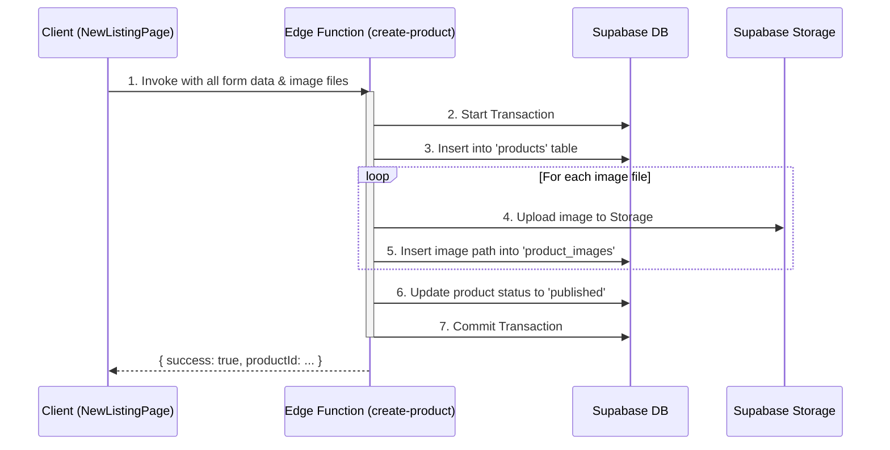

# Product Creation Workflow: Code Review & Refactor Plan

## 1. High-Level Assessment: The Core Problem

The fundamental issue with the current implementation is the **lack of atomicity**. The product creation process is fragmented across three independent client-side `fetch` calls to different API endpoints:

1.  `POST /api/products/create`
2.  `POST /api/products/images/add`
3.  `PUT /api/products/:productId/publish`

If any step fails after the first one, the system is left in an inconsistent state. For example, a product might be created in the database, but its associated images fail to upload, or the product is never published. This leads to orphaned data, a poor user experience, and difficult-to-debug issues.

## 2. Detailed Findings

### Security Vulnerabilities
- **Insecure Server-Side Logic:** The API routes contain `"DEMO MODE"` comments, explicitly stating that critical ownership and validation checks are being skipped. This is a major security flaw, as an authenticated user could potentially publish or modify products they don't own.
- **Client-Side Storage Uploads:** The client uploads images directly to Supabase Storage. While this can be secured with RLS policies, it is a less secure pattern than handling uploads on the server. It exposes your storage bucket structure and relies solely on RLS, which can be complex to manage perfectly.

### Performance Bottlenecks
- **Multiple Network Round-Trips:** The sequential nature of the API calls creates significant latency. The user must wait for three separate network requests to complete, making the UI feel slow.
- **Redundant Authentication:** The client gets the user session, and then *each* of the three API routes gets the user session again. This is inefficient.

### Incorrect Data Handling & Best Practices
- **Manual URL Construction:** The `/api/products/images/add` route manually constructs the public URL for the image. The correct and future-proof method is to store only the `path` and generate the public URL dynamically using `supabase.storage.from(...).getPublicUrl()`.
- **Transactionless Operations:** The database operations (inserting a product, inserting image records, updating the product status) are not wrapped in a transaction, which is the root cause of the atomicity problem.

## 3. The Proposed Solution: A Single, Atomic Edge Function

The entire workflow will be refactored into a **single, atomic Supabase Edge Function**. This is the standard and recommended Supabase pattern for handling complex, multi-step operations that require transactional integrity.

### New Architecture

### Benefits of this Approach
- **Atomicity:** The entire operation is wrapped in a database transaction. If any step fails (e.g., an image upload fails), the entire transaction is rolled back, leaving the database in a clean state.
- **Enhanced Security:** All logic, including authorization checks and file uploads, is handled in a trusted server-side environment.
- **Improved Performance:** The client makes only one network request to the Edge Function, dramatically reducing latency.
- **Best Practices:** This solution uses a database transaction, correctly handles storage paths, and centralizes the business logic, making the code cleaner and easier to maintain.

## 4. Implementation Plan

1.  **Create a New Supabase Edge Function (`create-product`):**
    *   This function will accept all product details and an array of images.
    *   It will perform all the database and storage operations within a single transaction.
    *   It will be responsible for all authorization and validation.

2.  **Refactor the Client-Side Component (`NewListingPage`):**
    *   The `onSubmit` handler will be updated to make a single call to the new `create-product` Edge Function.
    *   The direct `supabase.storage.upload()` call will be removed.

3.  **Deprecate Old API Routes:**
    *   The three existing Next.js API routes (`/api/products/create`, `/api/products/images/add`, `/api/products/:productId/publish`) will become obsolete and can be safely deleted.

4.  **Correct SQL and RLS Policies:**
    *   Provide the corrected SQL for the `product_images` table to ensure it stores the `image_path` (not the full URL).
    *   Validate that the RLS policies are sufficient for read operations, as write operations will now be fully secured by the Edge Function.